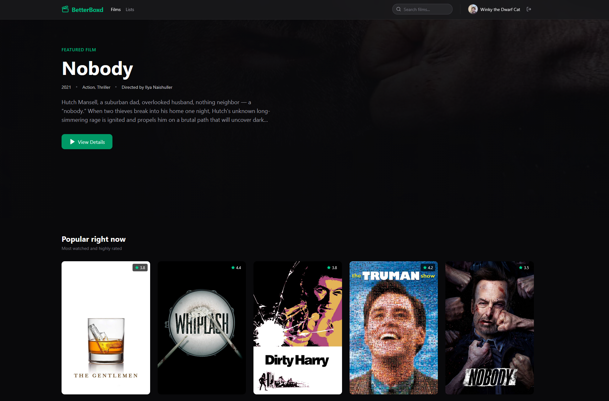
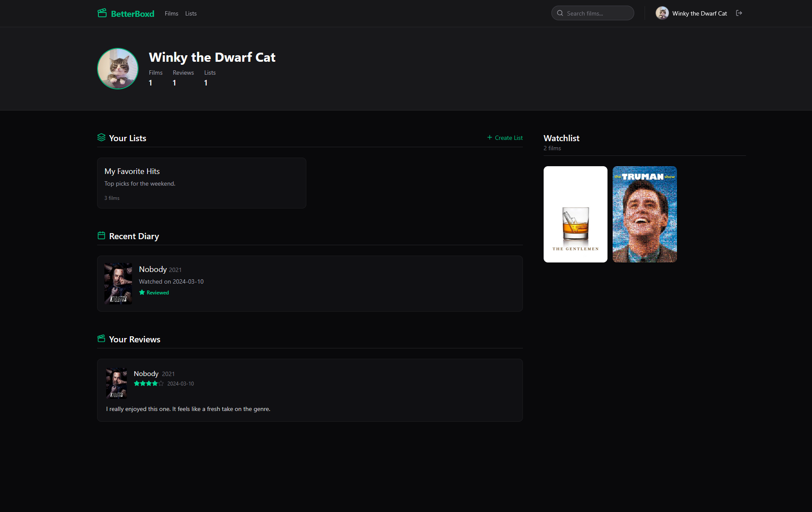
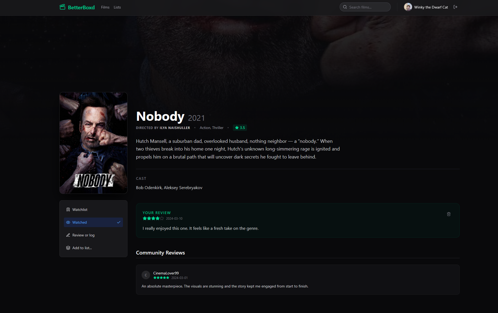
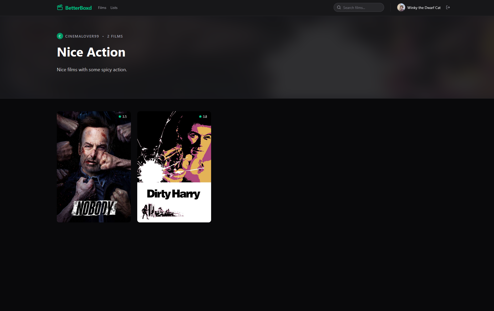
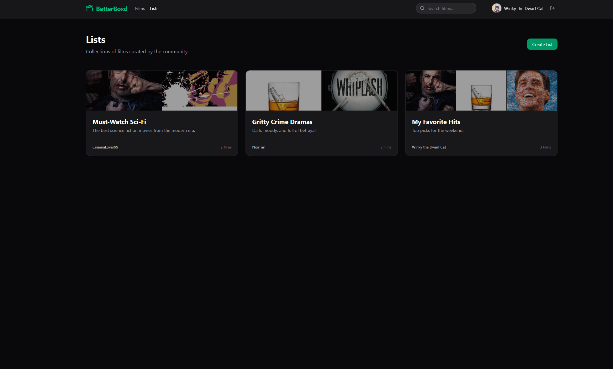

# Дизайн сайта
Общий вид страниц сайта. Макета не будет по техническим причинам, поэтому скрины всех страниц с пояснениями.

В общем хэдере - кнопка для перехода к списку фильмов, списку пользовательских списков, поиска фильма, а также для перехода к профилю и выхода из аккаунта.

## Главная страница

Главная страница сайта. Содержит список популярных фильмов и один избранный фильм. При прокручивании вниз отображается список всех фильмов с их оценками и краткой инфой.

## Страница профиля

Страница пользователя. Содержит краткую информацию о пользователе, пользовательские списки, недавние действия и обзоры, а также watchlist.

## Страница фильма

Страница фильма. Содежит постер и информацию о годе выпуска, режиссёре, жанрах, среднем рейтинге и актёрах а также краткое описание. Ниже располагаются отзывы, а также отдельно выделенный отзыв авторизованного пользователя. Под постером располагаются кнопки для добавления в watchlist, пометки как просмотренное, написания отзыва и добавления в пользовательский список.

## Страница списка

Страница пользовательского списка. Содержит его название, ник автора, количество фильмов и краткое описание, а также сами фильмы.

## Страница всех списков

Страница со всеми пользовательскими списками. Содержит карточки со всеми списками с их названием, описанием, автором и количеством фильмов.